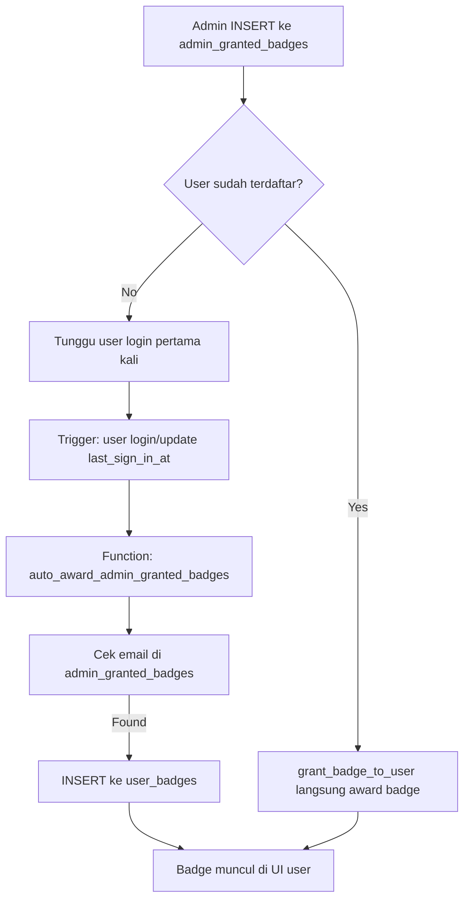

# 👑 Admin Granted Badges System - The Grand Architect

## 📋 Deskripsi

Sistem ini memungkinkan admin untuk memberikan badge khusus **"The Grand Architect"** secara manual kepada user tertentu sebagai bentuk apresiasi kepada orang-orang di balik pengembangan website Kitacoba.

Badge ini **TIDAK** bisa didapatkan melalui aktivitas normal user, melainkan hanya bisa diberikan oleh admin berdasarkan kontribusi mereka.

## 🎯 Fitur Utama

1. **Manual Grant**: Admin memberikan badge dengan memasukkan email user di database
2. **Auto Award**: Saat user dengan email terdaftar login, badge otomatis diberikan
3. **Instant Unlock**: Badge langsung terbuka (unlocked) dan bisa digunakan tanpa progress bar
4. **Admin Management**: Admin bisa menambah/menghapus akses badge kapan saja

## 🚀 Setup Database

1. Jalankan file SQL setup:
```sql
-- Di Supabase SQL Editor, jalankan file:
setup-admin-granted-badges.sql
```

File ini akan membuat:
- Tabel `admin_granted_badges` untuk menyimpan daftar email
- RLS policies untuk keamanan
- Trigger auto-award saat user login
- Function helper `grant_badge_to_user()` untuk kemudahan admin

2. Badge "The Grand Architect" otomatis di-update dengan `requirement_type = 'admin_grant'`

## 👨‍💼 Cara Admin Memberikan Badge

### Metode 1: Menggunakan Function Helper (Recommended)

```sql
-- Di Supabase SQL Editor atau API dengan service_role key:

SELECT grant_badge_to_user(
  'developer@example.com',              -- Email user
  'The Grand Architect',                 -- Nama badge
  'admin@kitacoba.com',                  -- Email admin pemberi (opsional)
  'Core developer tim Kitacoba'          -- Catatan (opsional)
);
```

Response:
```json
{
  "success": true,
  "message": "Badge granted and awarded to user",
  "user_id": "uuid-user-id"
}
```

Jika user belum pernah login:
```json
{
  "success": true,
  "message": "Badge granted, will be awarded when user logs in",
  "user_id": null
}
```

### Metode 2: Direct INSERT

```sql
INSERT INTO public.admin_granted_badges (user_email, badge_id, granted_by, notes)
VALUES (
  'developer@example.com',
  (SELECT id FROM public.badges WHERE name = 'The Grand Architect'),
  'admin@kitacoba.com',
  'Kontributor utama pengembangan website'
);
```

### Metode 3: Bulk Grant (Beberapa User Sekaligus)

```sql
-- Memberikan badge ke beberapa developer sekaligus
INSERT INTO public.admin_granted_badges (user_email, badge_id, granted_by, notes)
SELECT 
  email,
  (SELECT id FROM public.badges WHERE name = 'The Grand Architect'),
  'admin@kitacoba.com',
  'Tim developer inti Kitacoba'
FROM (
  VALUES 
    ('dev1@example.com'),
    ('dev2@example.com'),
    ('dev3@example.com')
) AS developers(email);
```

## 🔍 Melihat Daftar User yang Mendapat Badge

```sql
SELECT 
  agb.user_email,
  b.name as badge_name,
  agb.granted_at,
  agb.granted_by,
  agb.notes,
  CASE 
    WHEN ub.earned_at IS NOT NULL THEN 'Awarded ✅'
    ELSE 'Pending ⏳ (user belum login)'
  END as status
FROM public.admin_granted_badges agb
JOIN public.badges b ON agb.badge_id = b.id
LEFT JOIN auth.users u ON u.email = agb.user_email
LEFT JOIN public.user_badges ub ON ub.user_id = u.id AND ub.badge_id = agb.badge_id
ORDER BY agb.granted_at DESC;
```

Contoh output:
```
user_email              | badge_name           | granted_at          | granted_by          | notes                    | status
------------------------|----------------------|---------------------|---------------------|--------------------------|----------
dev1@example.com        | The Grand Architect  | 2025-12-08 10:00    | admin@kitacoba.com  | Core developer           | Awarded ✅
dev2@example.com        | The Grand Architect  | 2025-12-07 15:30    | admin@kitacoba.com  | UI/UX Lead              | Pending ⏳
```

## ❌ Mencabut Badge dari User

### Mencabut Akses (user tidak bisa dapat badge lagi):
```sql
DELETE FROM public.admin_granted_badges
WHERE user_email = 'user@example.com' 
AND badge_id = (SELECT id FROM public.badges WHERE name = 'The Grand Architect');
```

### Mencabut Badge yang Sudah Diberikan:
```sql
-- Hapus dari admin_granted_badges
DELETE FROM public.admin_granted_badges
WHERE user_email = 'user@example.com' 
AND badge_id = (SELECT id FROM public.badges WHERE name = 'The Grand Architect');

-- Hapus badge yang sudah earned
DELETE FROM public.user_badges
WHERE user_id = (SELECT id FROM auth.users WHERE email = 'user@example.com')
AND badge_id = (SELECT id FROM public.badges WHERE name = 'The Grand Architect');
```

## 🎨 Tampilan di User Interface

### Untuk User yang Mendapat Badge:

1. **Badge langsung UNLOCKED** (tanpa progress bar)
2. **Border hijau** menandakan badge aktif
3. **Bisa langsung diklik dan digunakan** di profil
4. **Icon terpilih** jika sedang aktif sebagai badge utama

### Untuk User yang Tidak Mendapat Badge:

1. **Badge LOCKED** dengan opacity rendah
2. **Border abu-abu** menandakan tidak available
3. **Tidak bisa diklik**
4. **Tidak ada progress bar** (karena tidak bisa didapat melalui aktivitas)

## 🔐 Keamanan

1. **RLS Policies**: User hanya bisa lihat badge mereka sendiri
2. **Service Role Only**: Insert/Delete hanya bisa dilakukan dengan service_role key
3. **Trigger Security**: Function trigger menggunakan SECURITY DEFINER
4. **Email Validation**: Sistem mengecek email di auth.users

## 🧪 Testing

### 1. Grant Badge ke Email Test:
```sql
SELECT grant_badge_to_user(
  'test@example.com',
  'The Grand Architect',
  'system',
  'Testing admin granted badges'
);
```

### 2. Verifikasi Grant:
```sql
SELECT * FROM public.admin_granted_badges 
WHERE user_email = 'test@example.com';
```

### 3. Login sebagai User Test:
- User dengan email `test@example.com` harus login
- Badge otomatis muncul di profile/badges
- Badge sudah unlocked dan bisa langsung digunakan

### 4. Cleanup Test:
```sql
-- Hapus test data
DELETE FROM public.admin_granted_badges WHERE user_email = 'test@example.com';
DELETE FROM public.user_badges 
WHERE user_id = (SELECT id FROM auth.users WHERE email = 'test@example.com')
AND badge_id = (SELECT id FROM public.badges WHERE name = 'The Grand Architect');
```

## 📊 Monitoring & Analytics

### Statistik Badge:
```sql
SELECT 
  b.name,
  COUNT(DISTINCT agb.user_email) as total_granted,
  COUNT(DISTINCT ub.user_id) as total_awarded,
  COUNT(DISTINCT agb.user_email) - COUNT(DISTINCT ub.user_id) as pending_award
FROM public.badges b
LEFT JOIN public.admin_granted_badges agb ON b.id = agb.badge_id
LEFT JOIN public.user_badges ub ON b.id = ub.badge_id
WHERE b.name = 'The Grand Architect'
GROUP BY b.name;
```

### User Terakhir yang Mendapat Badge:
```sql
SELECT 
  u.email,
  u.full_name,
  ub.earned_at,
  agb.granted_by,
  agb.notes
FROM public.user_badges ub
JOIN auth.users u ON ub.user_id = u.id
JOIN public.admin_granted_badges agb ON agb.user_email = u.email AND agb.badge_id = ub.badge_id
WHERE ub.badge_id = (SELECT id FROM public.badges WHERE name = 'The Grand Architect')
ORDER BY ub.earned_at DESC
LIMIT 10;
```

## 🎯 Use Case: Tim Developer Kitacoba

```sql
-- Contoh memberikan badge ke seluruh tim developer:

SELECT grant_badge_to_user('rizal@kitacoba.com', 'The Grand Architect', 'admin', 'Project Lead & Backend Developer');
SELECT grant_badge_to_user('andi@kitacoba.com', 'The Grand Architect', 'admin', 'Frontend Developer');
SELECT grant_badge_to_user('budi@kitacoba.com', 'The Grand Architect', 'admin', 'UI/UX Designer');
SELECT grant_badge_to_user('citra@kitacoba.com', 'The Grand Architect', 'admin', 'Database Administrator');
SELECT grant_badge_to_user('dewi@kitacoba.com', 'The Grand Architect', 'admin', 'DevOps Engineer');
```

## 🔄 Auto-Award Flow



## 📝 Notes

- Badge ini adalah **premium badge** dengan visual icon **👑**
- Tidak ada progress bar karena badge diberikan secara penuh (all or nothing)
- User yang sudah mendapat badge akan tetap memilikinya meskipun keluar dari daftar admin_granted_badges (kecuali dihapus manual dari user_badges)
- Sistem ini extensible - bisa digunakan untuk badge khusus lainnya di masa depan

## 🆘 Troubleshooting

### Badge tidak muncul setelah granted:
1. Cek apakah email user sesuai dengan email di auth.users
2. Pastikan user sudah login minimal sekali setelah badge diberikan
3. Verifikasi trigger berjalan dengan benar

### User tidak bisa klik badge:
1. Pastikan badge sudah di-award (ada di user_badges)
2. Cek requirement_type = 'admin_grant'
3. Verifikasi earned_at tidak null

### Error saat INSERT:
1. Pastikan menggunakan service_role key untuk bypass RLS
2. Cek badge_id valid
3. Verifikasi email format benar

## 🔗 Related Files

- `setup-admin-granted-badges.sql` - Database setup
- `app/profile/badges/page.tsx` - UI implementation
- `setup-badges-banners.sql` - Original badges system

---

**Created:** December 8, 2025  
**Last Updated:** December 8, 2025  
**Version:** 1.0.0
